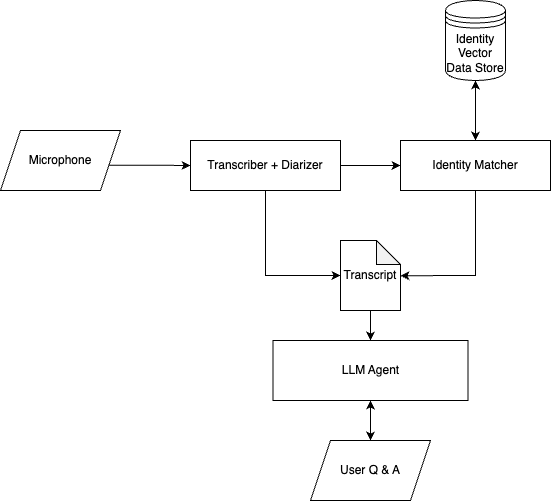

# Conversation Memory Recall System

## Overview
This project is a long-term memory recall system that records live conversations over time, diarizes the speakers, and stores the transcripts and speaker vectors for later querying. A chatbot powered by an LLM allows users to ask questions about past conversations and retrieve relevant information. Check out the YouTube demo at: https://www.youtube.com/watch?v=wLuj40q_U2Y



## Features
- **Live conversation recording**: Captures conversations from a microphone.
- **Speaker diarization**: Identifies and separates different speakers.
- **Transcript storage**: Stores conversations with timestamps and speaker labels.
- **Speaker vector representation**: Saves speaker embeddings for recognition across recordings.
- **LLM-powered chatbot**: Allows users to query past conversations for insights.

## File Structure
```
├── main.py                 # Records conversation, diarizes transcript, and saves speaker vectors
├── llm_frontend.py         # Runs an in-terminal chatbot to query transcripts
├── data/
│   ├── library/            # Speaker folders containing top 6 utterances and metadata
│   ├── output/             # Stores main transcript.txt with formatted conversations
│   ├── processed/          # Diarized transcripts of individual recordings
│   ├── raw/                # Raw recorded wav files
│   ├── temp/               # Temporary JSON diarized transcripts for speaker matching
├── requirements.txt        # Required dependencies
```

## Transcript Format
Stored in `data/output/transcript.txt`:
```
[2025-02-17 21:36:11] - Alisa: I made that mushroom. Of course it's good.
[2025-02-17 21:36:15] - Adrian: Do you think it could have done better with some pepper?
[2025-02-17 21:36:11] - Alisa: I think it could have done better with some turmeric.
[2025-02-17 21:36:15] - Adrian: Oh, really? I think Adam would have liked that.
[2025-02-17 21:36:35] - Adam: I agree.
```

## Installation
### Prerequisites
Ensure you have **Python 3.11.10** installed.

### Steps
1. Clone the repository:
   ```sh
   git clone git@github.com:adrianmc15/audio_memory.git
   cd audio_memory
   ```
2. Create a virtual environment:
   ```sh
   python3.11 -m venv venv
   source venv/bin/activate  # On Windows, use `venv\Scripts\activate`
   ```
3. Install dependencies:
   ```sh
   pip install -r requirements.txt
   ```

4. Set up the following environment variables:
   - `ASSEMBLYAI_API_KEY`: AssemblyAI API key for speech-to-text transcription (this can be done by getting an API key at https://www.assemblyai.com/ creating a `.env` file in the root directory with the key)
## Usage
### Recording Live Conversations
Run the main script to start recording and processing live conversations:
```sh
python main.py
```
or
```sh
python main.py live
```

### Pre-recorded Example
Run the main script with the "example" argument to process a pre-recorded conversation:
```sh
python main.py example
```


### Querying the Transcript
Launch the chatbot to interact with past conversations:
```sh
python llm_frontend.py
```
You can then ask questions about past conversations, such as:
```
How did Alisa feel about the mushrooms?
```

## Release Notes
This is version 9.1 of the project. It when you run main.py it currently records a conversation, diarizes the speakers, and saves the speakers to a library of utterances representing their vocal profiles. 

For now (as the project is still in development), it does not continuously record after that 3-minute chunk.

The one problem that needs to be addressed is request timeouts to the diarization API service. There are two ways this could be implemented, and these could be used together to ensure robustness.
- [ ] AssemblyAI has some documentation on a longer-term interaction with a specific diarization, where the request can be monitored once uploadedby sending more requests
- [ ] If the request times out, it can just be retried

## License
This project is licensed under the **Creative Commons Attribution-NonCommercial 4.0 International (CC BY-NC 4.0)** license. This means you are free to share and adapt the material for non-commercial purposes, provided you give appropriate credit. Commercial use requires explicit permission from the author.

For more details, see the full license text: [CC BY-NC 4.0](https://creativecommons.org/licenses/by-nc/4.0/)

## Author
Adrian McIntosh (adriandonaldmcintosh@gmail.com)


